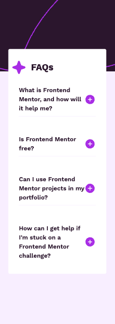

# Frontend Mentor - FAQ accordion solution

This is a solution to the [FAQ accordion challenge on Frontend Mentor](https://www.frontendmentor.io/challenges/faq-accordion-wyfFdeBwBz). Frontend Mentor challenges help you improve your coding skills by building realistic projects.

## Table of contents

- [Overview](#overview)
  - [The challenge](#the-challenge)
  - [Screenshot](#screenshot)
  - [Links](#links)
- [My process](#my-process)
  - [Built with](#built-with)
  - [What I learned](#what-i-learned)
  - [Continued development](#continued-development)
  - [Useful resources](#useful-resources)
- [Author](#author)
- [Acknowledgments](#acknowledgments)

## Overview

### The challenge

Users should be able to:

- Hide/Show the answer to a question when the question is clicked
- Navigate the questions and hide/show answers using keyboard navigation alone
- View the optimal layout for the interface depending on their device's screen size
- See hover and focus states for all interactive elements on the page

### Screenshot

### Links

- Solution URL: [Add solution URL here](https://your-solution-url.com)
- Live Site URL: [Add live site URL here](https://your-live-site-url.com)

## My process

The accordion component tracks which item is currently expanded using expandedIndex. Initially, all accordions are closed (-1). When a user clicks an accordion header:

If it’s already open, expandedIndex is set to -1 to close it.

If it’s closed, expandedIndex is updated to the clicked index.

Only one accordion can be open at a time. The component maps through the faqData, showing the content and toggle icon based on the current expandedIndex.

### Built with

- [React](https://reactjs.org/) - JS library
- [Tailwind](https://tailwindcss.com/) - CSS library

### What I learned

Learning Reflections

Practiced Tailwind CSS in a real component—helped reinforce utility-first styling.

Applied a reusable state pattern from a previous component library project.

Learned to structure logic in a clean, scalable way using expandedIndex.

Reinforced the importance of thinking ahead for scalability (more accordions or nested structures).

### Continued development

Responsive images: Need to handle image sizing across different layouts more effectively using Tailwind responsive classes.

Accessibility: Currently missing ARIA attributes and semantic HTML. Future improvements include using <button> for headers, adding aria-expanded/aria-controls, descriptive alt text, and enabling keyboard navigation.

## Author

- Website - [Lauren Molloy](https://www.linkedin.com/in/lauren-a-molloy/)
- Frontend Mentor - [@LaurenAMolloy](https://www.frontendmentor.io/profile/yourusername)
